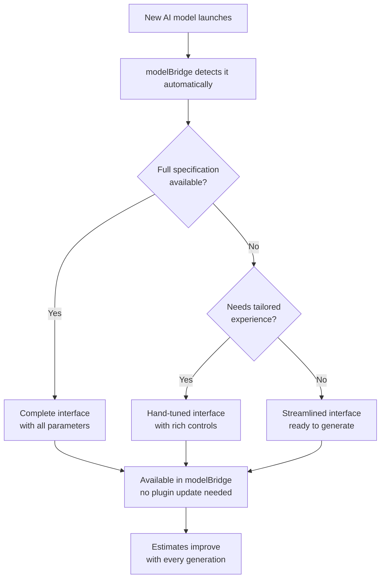

# Architecture

How modelBridge is built — design principles, current state, and development practices.

---

## System Design

modelBridge is a three-layer system: a Premiere Pro panel, a local media processing backend, and a cloud operations layer. The panel handles UI and user interaction. The backend handles media extraction, uploads, and downloads. The cloud layer monitors the AI model catalog, manages licensing, and delivers remote updates.

All three layers are designed to operate independently — the panel works offline with cached data, the backend recovers automatically from crashes, and the cloud layer delivers updates without requiring a plugin release. No single point of failure — panel, backend, and cloud layer degrade gracefully if any component is unavailable.

The cloud layer runs autonomously — detecting new models, verifying schemas, and ensuring only working models reach the UI, without manual intervention.

---

## Core Design Principles

**Adaptive.** Most models get their interface generated automatically from the provider's API specification — no per-model code. When a specification isn't available, the system still builds a working interface from what it knows about the model. High-demand models can receive a hand-tuned interface with richer controls. All three paths produce the same result for the user: a complete, ready-to-use generation form. This is how over 1,200 models are supported without plugin updates — and how a model that launched this morning is usually something an editor can run this afternoon, rather than something that waits for our next release. That is the difference between a live catalogue and a curated partner list, and it is the only claim here worth making.

**Usage-calibrated.** The plugin learns from usage. When a model rejects media, the constraint is remembered and enforced automatically on future attempts. Cost estimates improve as your metered usage accumulates. Generation time estimates appear after a few uses and converge toward your actual experience the more you generate.

**Resilient.** User data survives cache clears, application updates, and plugin reinstalls. Automatic backup before every data migration. Silent recovery when primary storage is unavailable. No "start over from scratch" scenarios.

**Remotely updatable.** Error handling, endpoint changes and feature flags are delivered over-the-air. When something changes in the AI ecosystem, the response ships without a plugin release and without user action; the manifest carries a one-hour cache, read at panel start, so it reaches an editor the next time they open the panel. Model intelligence arrives the same way from the plugin's own cloud service rather than the update channel, and curated pricing corrections travel neither: they ship bundled in a plugin release, so a cost estimate can never be changed remotely.

**Defensive.** All external data is parsed defensively — invalid values are rejected before they reach business logic. Validation runs before every generation to prevent wasted API credits.

---

## Model Discovery & Availability

modelBridge continuously monitors the AI model ecosystem. When a provider launches a new model, the system detects it automatically — no one adds it by hand, and no plugin release is involved.

**The cadence, stated rather than promised.** The cloud layer wakes every two hours and runs one of three phases in rotation — discover, validate, publish — so each phase comes round roughly every six hours, and the pointer only advances on success, so a failed pass retries rather than skipping ahead. A new model therefore has to be seen, then verified, then published, and what an editor sees adds a CDN hop and the panel's own catalogue cache on top. We describe this as same-day rather than same-hour because the honest bound is the sum of those steps, not the interval of any one of them.

**What happens next depends on what the provider has published:**

- If the model has a full API specification, modelBridge builds a complete interface with parameter controls, validation, and cost estimates — all automatically, no human in the loop.

- If the model is live but its specification isn't published yet, modelBridge still makes it available with a streamlined interface. Users can start generating immediately while the system watches for the full specification to appear.

- For high-demand models from major providers, modelBridge can deliver a hand-tuned interface with richer controls and more precise cost estimates — layered on top without disrupting the automatic path.

**The result:** new models rarely stay unavailable for long after launch. The system handles the common case automatically and escalates the rest. Users never have to wait for a plugin update to access a new model.

This also means modelBridge doesn't just track models that work today — models that aren't fully ready yet become available the moment they are.

---

## Scale

| | |
|---|---|
| Supported AI models | over 1,200 across 11 categories |
| Panel codebase | Tens of thousands of lines of JavaScript and CSS |
| Design system | Token-driven — visual consistency across every surface |
| Documentation site | 75+ pages across guides, reference, Academy, and legal |
| Automated tests | 6,516 checks across 266 suite files — 6,391 green, 125 failing, measured 2026-09-02 by one command whose output a pre-commit guard checks every published figure against. Plus 7 catalogue audits and end-to-end import tests against a live Premiere |
| Built by | One developer — structured for team onboarding and handover (documented conventions, migration plan, and test suites) |

---

## Development Practices

**Structured documentation.** The project includes extensive internal documentation — architecture overviews, system deep-dives, convention guides, and behavioral rules. This documentation follows a structured format that is consumable by both human developers and AI coding agents, enabling a new developer to orient within the codebase using standard tooling.

**Test coverage.** Automated test suites validate the critical paths: error normalization and translation across all fal.ai error formats, cost estimation accuracy across 11 pricing formula types, dual-mode input synchronization and field aliasing, parameter override behavior, visual rendering consistency, and pricing supplement parsing. End-to-end tests verify the full pipeline — from generation request through background polling to timeline import — across four import scenarios (insert, video replace, image replace, audio replace). A catalog-wide classification audit runs every model through the schema parser; a separate field-mapping audit has verified widget classification across 10,000+ input fields.

**Conventions and rules.** Coding conventions, commit standards, and architectural rules are documented and enforced consistently. Every error must go through the translation layer — no raw API output reaches users. Every data migration must create a backup first. Every bug fix must check for the same class of problem elsewhere in the codebase.

**Release process.** Cloud updates follow a review workflow with integrity verification (SHA-256 checksums) before deployment. Plugin releases are packaged as ZXP installers with version-tracked changelogs.

---

## Platform Integration

### fal.ai

modelBridge integrates with fal.ai at multiple API levels — not just the generation endpoint.

**Model catalog.** The plugin consumes fal.ai's authenticated model listing and browse APIs, including popularity ranking, category classification, and schema endpoints. The catalog is treated as a live data source, not a static list — new models, schema changes, and retirements are detected and handled automatically. Why the architecture is built on this catalogue rather than a hand-picked subset is set out in [Why fal.ai](https://docs.modelbridge.app/why-fal-ai/).

**Schema parsing.** Every model's OpenAPI specification is fetched, parsed, and used to generate the complete UI — input fields, validation rules, media requirements, and parameter constraints. The plugin supports both fal.ai's queue API and platform API endpoints, with automatic fallback between them.

**Pricing.** Cost estimates use fal.ai's official pricing API as one of several sources. The plugin respects fal.ai's published rates and makes no attempt to scrape or infer pricing outside of official endpoints.

**Error specification.** The plugin implements full coverage of fal.ai's error response formats — both structured validation errors (Format A) and infrastructure errors (Format B), including the `X-Fal-Retryable` header, `ctx` structured constraint data, and error documentation URLs. Error types are translated to user-facing language before display. Five semantic categories (INPUT_QUALITY, CREDITS_BILLING, NETWORK_RETRY, CONTENT_POLICY, DEVELOPER_BUG) drive consistent visual treatment across all error surfaces. Billing and input errors are surfaced independently, so one never masks the other, and no error is ever silently swallowed.

**Resilience to API changes.** The schema-driven architecture is inherently resilient to changes in fal.ai's model catalog — new models, updated parameters, and revised constraints are absorbed automatically without code changes. Schema fetching uses a fallback chain with stale-cache recovery, so a temporary API issue never blocks the user. If a model endpoint is renamed or retired, the plugin detects the change and handles it gracefully.

### Consuming the fal.ai API in production

The section above lists what modelBridge integrates with. This one is the engineering account of consuming it — where the API's own shape sets the terms of the integration, and what was built to meet them. Numbers carry the date they were produced; **measured** means observed in a live run or against a captured corpus, as opposed to read from documentation.

**The schema is the interface.** Every generation form is rendered from the model's OpenAPI document — the automatic path has no per-model UI code, so the document is not an input to the UI, it *is* the UI. The working corpus behind the numbers here is 1,497 schema responses captured through the plugin's own fetch path — 14,025 input properties — of which 11,523 fields across 1,143 models were reachable in the shipping catalog when the render snapshot was taken (2026-08-06). Those fields resolve to a closed set of widget kinds in 35 widget-by-placement combinations, and the catalog's media-input space collapses to 26 distinct shapes — combinations of required and optional image, video and audio inputs (swept 2026-08-13). None of these sets is static: a new shape arrives with the first model that carries it, announced by nothing except the schema itself, which is why the shape sweep is a rerunnable script rather than a table in a document.

Most of a form derives cleanly — types, enums, numeric ranges, defaults, required flags, media roles. Two properties of the corpus have to be met deliberately:

- **Nullability is an idiom, not a type.** 1,963 fields across roughly 70 % of models express "optional" as OpenAPI 3.0's `anyOf: [{type:"string"}, {type:"null"}]` rather than a scalar type (measured 2026-08-06). A consumer that matches only scalar `type` values loses all of them in a single day if the catalog ever serializes as OpenAPI 3.1, where the same fields become `type: ["string","null"]` — an array. The classifier is therefore written to fail loud rather than open: any property that reaches the end of its handled branches — type arrays included — renders as an explicitly labelled raw-JSON field, never as a silent bare text box. The failure mode of an unrecognized construct is a labelled field, not a paid-for malformed request.

- **Schemas change with no revision marker.** A schema can change underneath an installed model, and nothing in the document announces it — change detection is the consumer's job. Installed endpoints are re-verified at startup and on a 24-hour cycle; a changed schema hash rebuilds the form on the model's next open; and a normalized shape baseline — field name, type, required flag and enum values, 214 fields across 22 schemas, captured 2026-08-06 — exists so a later capture has something to diff against.

Some things do not derive at all. 18 of the 1,497 schemas declare no inputs. Some constraints exist only as prose in field descriptions — readable by a person, not by a parser (the consequence is picked up under media constraints below). The hand-tuned adapters and the streamlined prompt-only interface described earlier exist for exactly the models where the automatic path cannot deliver the whole form.

**A status word is not the whole status.** The queue API reports IN_QUEUE, IN_PROGRESS, COMPLETED, FAILED. The edge, measured live on 2026-08-15 from two real requests: a terminal failure can be reported on a status other than FAILED. One request was still reported as IN_PROGRESS two days after submission, with `inference_time: 0.0` and a runner-acquisition failure sitting in its `error` field the entire time; the other reported COMPLETED with `error_type: "runner_disconnected"` and no result URL. A consumer that reads "not terminal" as "still running" renders "Generating…" forever on the first and retries a result fetch forever on the second — which is what this plugin did before the measurement, and is the incident the following machinery comes from.

- **Terminality is classified from the whole payload, not the status word.** The classification rule was derived from the two captured payloads, which now serve as the regression fixtures — and it is conservative in the direction that matters: an ambiguous in-flight payload passes through untouched, because a false terminal would kill a live run.
- **An unknown status renders as unknown, never as progress.** One shared resolver maps status words to progress stations for every surface, so a value outside the known vocabulary cannot be painted as motion by one component and as unknown by another (shipped 2026-08-16).
- **"Generating" carries a freshness requirement.** A running generation that has gone 90 seconds — three times the slowest poll cadence — without an understood response flips to an explicit checking state showing when contact was last confirmed. Progress is a claim backed by a recent, understood answer, not by the absence of a terminal one.
- **A 30-minute wall ends the wait honestly.** The run settles as stopped on every surface and points at the fal.ai dashboard — the charge may be real even when delivery is not, so the terminal state names where the authoritative record lives.
- **`X-Fal-Retryable` outranks local heuristics.** When the header is present, the provider's own retryability verdict overrides every client-side guess.

**The dollar is a derivation, and every label says whose.** What the API emits about money is precise but partial. `x-fal-billable-units` on a result is a quantity — never a dollar. `GET /v1/models/pricing` is a per-unit rate. The identity `cost = units × unit price` reproduced fal.ai's own arithmetic in all four metered runs, across three model classes, in which it was tested (2026-08-25), fractional quantities included. But the unit is the model author's own convention, with no cross-catalog rule to lean on — measured the same day: one video family normalizes resolution into the quantity (the same second of output bills a different unit count at 720p than at 1080p), another books usage in token blocks, and the same model reached through an endpoint alias is a separate pricing row in a third unit. Quantity follows the nominal request, not the delivered output (a 5-second request bills as 5 seconds even when the delivered clip runs a fraction longer). The function from parameters to units — the thing a pre-run estimate actually needs — is not machine-readable anywhere: the rate is published; the quantity rule is not.

The product's cost labels map one-to-one onto what the provider handed over for that specific number:

| Label | Backed by |
|---|---|
| **Metered $X** | fal.ai reported a usage quantity for this run — the dollar is that quantity × the known rate |
| **Calculated $X** | the run finished without a quantity — the dollar is modelBridge's own formula |
| **Estimated $X** | pre-run, from curated per-model pricing |
| **Learned ≈$X** | pre-run, the median of your own metered history for these exact settings |
| **From $X** | pre-run, fal.ai's published base rate — a floor, not a prediction |
| **No price** | no source qualifies, so no number is shown |

About 61 % of the active catalog (856 of 1,392, measured 2026-07-24) prices in a unit that converts to a per-output figure and can carry a "From $X" floor; the rest show "No price" rather than an approximation. The word "Billed" appears nowhere in the product, because no per-request dollar from fal.ai exists to anchor it. And when the pricing API omits its `unit` field, the absence is treated as unknown and falls to "No price" — an earlier version defaulted the missing field to per-request, which silently repriced per-second models as flat-rate, and that class of confident wrong number is exactly what the labelling discipline exists to make impossible.

**What the panel knows before you spend.** Selected media is validated against the model's declared limits on a half-second cycle while a clip is selected — dimensions, duration, file size, aspect ratio — and a failing clip is refused with the reason on the thumbnail ("Video too long (21.6 s, max 20 s)") before any request leaves the machine. The ceiling on that is what schemas declare, and the machine-readable constraint vocabulary is small and unevenly used. The extractor reads nine `x-fal` keys (min/max width and height, min/max duration, max file size, min/max aspect ratio); the corpus also carries `min_fps`/`max_fps` on 14 schemas — one model family, always on video inputs — plus `multiple_of`, `min_area`/`max_area` and `timeout`, not yet consumed. On a 58-model reference install (2026-08-20), 4 of the 41 media-taking models declared any machine-readable limit at all; the rest enforce their limits server-side, in prose, or not at all.

The mitigation is that a rejection teaches. When a generation fails validation, the structured `ctx` object in the error — `{"min_width": 300, "min_height": 300}` — is read first, with a phrase-anchored parse of the message as fallback, and the limit is stored per model and enforced at preflight from then on: the same clip against the same model is refused client-side next time, before spend. The learner is deliberately narrow — only validation-class errors can mint a constraint (a billing or infrastructure error never can), every record carries a version stamp so a bad vintage can be invalidated wholesale, and learned limits fill gaps under declared ones, never override them. `ctx` is the part of the error contract that makes this loop dependable: it is machine-readable where the message is prose, and it is the reason the same mistake does not cost money twice.

This section is about what the API demands. How often we ask of it — poll volume per generation and the backoff behind it, the catalogue synchronisation cadence and what that cadence costs in freshness, and the same accounting for the other two services modelBridge depends on — is in [`PERFORMANCE_AND_LOAD.md`](PERFORMANCE_AND_LOAD.md), together with the panel-side measurements and the findings we got wrong.

### Agent Mode (Adept)

Agent Mode is a natural-language layer on top of modelBridge's Premiere Pro integration. Editors describe what they want in plain language; the agent reads the timeline, plans the operation, executes edits, and reports back.

**Adept — the intelligence layer.** Agent Mode runs on the user's own Claude API key, but it isn't a general chatbot bolted onto Premiere. modelBridge applies an intelligence layer called Adept that tailors the agent for Adobe's environment:

- **Wired into the Premiere toolkit.** Adept reads timelines, edits clips, runs quality checks, and delivers, all from plain language.
- **Finds a way around technical limits.** When Premiere's scripting can't cross a boundary directly, Adept looks for a workaround that still reaches the goal, instead of giving up or handing the problem back.
- **Checks its own work.** Timeline-shape edits are re-read from the real timeline after they run, and when a change can't be confirmed the agent says so instead of reporting success.
- **Honest by design.** Adept says plainly when something genuinely can't be done, and never guesses at a cause it can't see.
- **Reports its own coverage.** Tools that sample rather than read everything return how much of the request they covered — counts of what was expected against what was produced, plus named lists of what was never opened and what could not be read. The schemas instruct the model that a confident verdict over an unread item is a false claim. A truncated result otherwise looks exactly like a complete one, which is the failure mode this closes.
- **Cannot spend money by itself.** A generation requested in chat is staged, not started: inputs resolved against the model's schema, validated, and returned with a cost estimate. Firing it requires a button the agent can only ask for, and the click re-checks that the model and the media are still the ones that were approved — refusing rather than re-binding if either drifted. The gate is code on the click path, not an instruction in a prompt.

The result: Adept solves problems a raw model would hand back to the user.

**What Adept can do today.** Timeline introspection, clip editing (move, trim, split, delete), property adjustment (scale, position, opacity, speed, Lumetri), effect and transition management, track and sequence operations, LUT scans and batch color operations, multi-platform export (Instagram / TikTok / YouTube / Twitter / X / LinkedIn / Facebook), environment-aware silence removal, quality-control inspection, and direct handoff into modelBridge generation flows for AI-driven edits.

**Available models.** Claude Haiku 4.5 (default, fast + cheap) and Claude Sonnet 4.6 (deeper reasoning). Editors switch per conversation.

**Privacy.** Conversations are sent directly to Anthropic's API using the editor's own key. modelBridge does not store, log, or relay conversation content. No conversation data transits modelBridge infrastructure. Absolute media paths are replaced with opaque, session-scoped references at a single choke point before anything is sent and resolved back locally on return — a sequence counter rather than a hash, since a hash would be stable across sessions and would itself identify the file. Filenames still travel, because the agent has to name the clip; the boundary is stated in the source rather than implied.

### Adobe Premiere Pro

modelBridge is a deep Premiere Pro integration, not a standalone panel that happens to run inside the application.

**Timeline interaction.** The plugin reads and writes to the active sequence — clip selection, track identification, In/Out points, playhead position, and sequence metadata. Generated media is placed on the correct track, at the correct timecode, with frame-accurate positioning.

**Source Monitor.** Results can be opened directly in Premiere Pro's Source Monitor for full-resolution evaluation. Editors can set In/Out points in the Source Monitor and import only the selected range.

**Media awareness.** The plugin reads clip properties from the timeline — dimensions, duration, file path, track index — and uses them for validation, media extraction, and context-aware import decisions (replace in-place vs. insert at playhead vs. route to audio track).

**ExtendScript bridge.** A host layer of a few hundred global ExtendScript functions handles communication between the panel and Premiere Pro's scripting engine — covering clip selection, sequence queries, project bin management, timeline manipulation, and fit-to-frame scaling. Host communication is being consolidated behind an adapter layer: 77 % of host calls route through it today, with the agent layer fully converted and the generation pipeline deliberately left until after launch. See [UXP_MIGRATION.md](UXP_MIGRATION.md) for the full measurements, including what the adapter layer does *not* cover.

---

## Operational Infrastructure

The cloud operations layer is deployed on an edge runtime and runs continuously, around the clock. It is stateless by design; all persistent state is stored in a key-value store that is portable across edge providers.

**Failure recovery.** If the cloud layer is unavailable, the panel continues operating with cached data — the catalog, pricing, and model intelligence all use stale-while-revalidate strategies. When the cloud layer recovers, data refreshes silently in the background.

**Monitoring.** The cloud layer produces structured event logs and sends operator alerts for anomalies — catalog disruptions, licensing events, and schema verification failures. Daily digests summarize catalog health and subscription activity. Instant alerts fire for urgent events that require manual attention.

**Local backend recovery.** The Node.js backend on localhost includes health monitoring, automatic restart on crash (up to three attempts), keep-alive pings, and port conflict detection. If the backend is unreachable after all recovery attempts, the panel surfaces a clear status message with a manual restart option.

### Self-running systems inventory

The following systems operate autonomously — reducing manual maintenance and keeping the plugin current between releases.

**Catalog pipeline.** The cloud layer watches the full fal.ai catalog around the clock. New models are verified before they reach the panel — a model with a broken or unpublished spec is held back and re-checked automatically, and promoted the moment it becomes usable. Models that disappear from fal.ai are confirmed over multiple checks before being marked gone, so a temporary API glitch never wipes anything — and a model that returns is restored automatically.

**Plugin-side health checks.** Installed models are re-verified quietly in the background, without ever blocking the user. Renamed endpoints are migrated silently; a model whose spec changed gets its interface rebuilt on next open; and only models that fal.ai has genuinely removed are surfaced — with a one-click cleanup — never on the strength of a single failed check.

**News feed.** New models in news-worthy categories are automatically published as news items. The plugin displays these as compact banners with a "Today" badge and one-click install. The feed also supports manual entries (feature updates, maintenance notices, tips) via an admin API.

**Operator notifications.** The operator gets daily digests of customer activity, catalog movement, and pipeline health, with instant alerts for anything urgent. Quiet days collapse to a single line — length itself is the signal.

**OTA updates.** Error documentation, error message templates and endpoint migrations are delivered over-the-air from a remote manifest. Each control is named per channel rather than claimed across all of them:

- **The file payloads are pinned.** Every file the manifest declares carries a SHA-256, verified before the payload is applied. A mismatch, a missing pin or an unreachable file rejects the payload and the copy bundled in the extension serves instead — the channel fails closed, never open.
- **Remote configuration is constrained, not pinned.** The config file that carries incident banners, kill switches and per-model validation modes is not hash-verified. It is bounded instead: schema sources must match an exact host allowlist, and only the kill switches the channel itself declares may be set, so it cannot reach a flag it does not own.
- **Feature flags ride in the manifest body**, which carries no hash of itself. What protects them is that the manifest is served from a repository only we can write to — the same trust root as the pins, stated plainly rather than implied by the sentence above.

**Self-learning validation.** When a model rejects media or a setting for a requirement its spec never declared, modelBridge remembers the requirement and enforces it before the next attempt — on the media card and in the form. The lesson survives cache clears and updates, and you're told once, the first time, that it was learned.

**Cost learning.** Estimates sharpen from your own usage — after a few generations with a model, your real metered costs refine the estimate for exactly the settings you use. A learned estimate that goes unused long enough retires rather than going stale.

**Generation time learning.** After a few generations with a model, its card shows a time estimate based on your own runs — and it keeps converging toward your actual experience.

**Background generation recovery.** If Premiere Pro restarts during an active generation, recovery data persists locally. On next panel open, a recovery bar lets the user resume polling with the original request ID.

**Model insights enrichment.** Editor-focused highlights for each model are generated in the cloud, cached locally, and refreshed quietly in the background — every model card tells you what the model is actually good at, in an editor's terms.

**Capability badges.** Model cards show what a model can do — HD, 4K, audio, LoRA support, extendable duration — derived automatically from the model's own spec, so new models arrive correctly labeled with no manual list to maintain.

**License revalidation.** Subscription status is reverified periodically. An offline grace period allows the plugin to function without connectivity. Trial countdowns, payment grace periods, and status transitions are handled without user action.

**Exchange rates.** Cost displays support multiple currencies with live rates from a public API. Fallback defaults are used when the API is unreachable. Historical rates are stored per generation for accurate retrospective reporting.

**Thumbnail backfill.** Models without preview images are backfilled lazily in the background — concurrency-capped, non-blocking, with smooth transitions in the UI.

**Visibility-aware polling.** When the panel is hidden, non-critical background work pauses automatically. Generation polling and server health checks continue; everything else waits.

**Anonymous error telemetry.** Unrecognized errors produce anonymous reports (error type, HTTP status, model endpoint, plugin version — no prompts, paths, keys, or personal data). This is how new error types are discovered for documentation. Off by default — enabled only if you opt in from Settings.

**Support infrastructure.** Hundreds of curated parameter explanations (hand-written, not auto-generated) provide contextual help via ⓘ icons across all models. Dozens of documented error codes link to structured troubleshooting pages. Context-aware validation templates interpolate exact constraint values into error messages. Academy articles appear as contextual links on model cards — only when relevant to the selected model.

---

## Data Architecture

All user data — saved models, settings, generation history, cost logs, and learned constraints — is stored locally on the user's machine. No user data is stored on modelBridge servers. Generated media is downloaded directly from fal.ai to a local project folder.

The cloud operations layer stores catalog state (model availability, schema verification status) and licensing state (subscription status, device identifiers). It does not store user-generated content, prompts, API keys, or personal information beyond what is provided during license activation — or in a bug report you explicitly choose to send.

API keys are stored locally and transmitted only to fal.ai directly — never to modelBridge infrastructure. Anonymous error telemetry (error type, model endpoint, plugin version) can be disabled by the user at any time.

Full data architecture, retention policies, and third-party data flows are documented in the [Privacy Policy](https://docs.modelbridge.app/legal/privacy-policy/).

---

## Security & Privacy

User API keys are stored locally and used exclusively for direct communication with fal.ai — they never transit modelBridge infrastructure. The OTA update channel (GitHub raw content) is read-only and carries no user data. License validation transmits only the license key and a device identifier over HTTPS.

The local backend runs on localhost only and is not exposed to the network. Anonymous error telemetry is opt-in (off by default) and contains no prompts, file paths, media, or personal information. Behavioral analytics is opt-in only.

For full data inventory, GDPR compliance measures, subprocessor list, and retention policies, see [PRIVACY_AND_COMPLIANCE.md](PRIVACY_AND_COMPLIANCE.md).

Comprehensive privacy coverage — including GDPR, CCPA, LGPD, UK GDPR, and AI Act positioning — is published at [docs.modelbridge.app/legal/privacy-policy/](https://docs.modelbridge.app/legal/privacy-policy/).

---

## Scalability

modelBridge is a client-side application — each installation runs its own panel and local backend. There is no shared server infrastructure that becomes a bottleneck as the user base grows.

**Panel and backend.** Run locally per user. Scaling is linear — each new user is an independent instance with no shared state.

**Cloud operations layer.** Runs on an edge runtime with automatic geographic distribution. Catalog monitoring and schema verification are read-heavy workloads against fal.ai's public APIs, bounded by the size of the catalog (currently over 1,200 models), not by the number of modelBridge users.

**OTA delivery.** Served from a global CDN. Static files, no compute per request. Scales to any number of users without infrastructure changes.

**Known limits.** The local backend processes one media extraction at a time per generation. Background generations queue at the fal.ai API level, not locally. The primary scaling constraint is fal.ai's own API rate limits, which apply per user API key. Current scale and functional constraints are documented in [Known Limitations](https://docs.modelbridge.app/reference/limitations/).

---

## Dependencies & Licensing

### Proprietary code

The modelBridge codebase — panel JavaScript, CSS design system, cloud operations worker, schema parsing engine, cost estimation system, error handling pipeline, and all documentation — is proprietary. A small set of Premiere Pro control tools used by Agent Mode is vendored from the open-source `leancoderkavy/premiere-pro-mcp` project (MIT); see [NOTICE.md](NOTICE.md) for attribution.

### External service dependencies

| Dependency | Role | License / Terms |
|---|---|---|
| fal.ai API | AI model generation, schema, pricing, catalog | Commercial API — user authenticates with their own key |
| LemonSqueezy | Subscription billing, license validation | Commercial SaaS — webhook integration |
| GitHub raw content | OTA delivery — error docs, error copy, endpoint migrations (each SHA-256 pinned); remote config and feature flags (host- and switch-allowlisted, not pinned) | Public CDN — read-only, no user data sent |

### Local runtime dependencies

| Dependency | Role | License |
|---|---|---|
| Node.js + Express | Local backend server | MIT |
| FFmpeg / FFprobe | Media extraction (video frames, audio, metadata) | LGPL — bundled as LGPL-only builds, invoked as external processes |
| Sharp | Image processing (thumbnails, format conversion) | Apache-2.0 |
| libvips | Image processing library used by Sharp | LGPL-3.0-or-later (dynamically linked, user-replaceable) |

FFmpeg and FFprobe ship with the plugin as **LGPL-only builds** — compiled without the GPL and non-free components, verified from the build configuration of each binary — and are invoked as separate processes, never linked. libvips is dynamically linked and user-replaceable. Complete attributions, licence texts and build provenance ship with the plugin. All other runtime dependencies are permissively licensed.

The macOS binaries are built from source rather than downloaded, and the build is a deliberately small one: `--disable-everything` with an explicit allowlist of demuxers, decoders, encoders, muxers and filters, `--disable-autodetect`, and **`--disable-network`** — leaving `file` and `pipe` as the only two protocols compiled in. That bundled macOS binary has no network code in it at all.

**The guarantee is about that binary, not about every ffmpeg the product may end up running,** and the distinction is worth stating precisely because it is the kind that gets rounded off. Two cases fall outside it. The Windows binaries are a downloaded LGPL release build rather than one we compile, and it is a general-purpose build with network protocols present. And on either platform, if the bundled binaries are missing, the backend falls back to a copy already installed on the machine — the user's own ffmpeg, built by someone else, about which no build claim can be made. Each binary's origin, full configure string and SHA-256 are recorded in `bin/ffmpeg-provenance.json`, which ships inside the extension, so which case you are in is checkable without trusting this document.

In all three cases ffmpeg is invoked on local file paths only, as a separate process, and nothing in the product asks it to open a URL. The narrower claim — that the macOS build *cannot* reach the network even if asked — holds for the bundled macOS build alone. See [NOTICE.md](NOTICE.md) for the linked libraries these builds carry.

### Proprietary components

- UI rendering and schema-driven interface generation
- Field classification and input parsing
- Cost estimation engine
- Self-learning validation system
- Error translation and handling pipeline
- OTA update infrastructure
- Cloud operations worker (catalog monitoring, insights, licensing)
- All 75+ documentation pages

---

## Platform Roadmap

Adobe is transitioning Premiere Pro extensions from CEP to UXP. modelBridge is designed with this migration in mind — not as a future project, but as an active constraint on all current development.

**Migration plan.** A detailed migration plan is in place, covering interface contracts, an API parity mapping between ExtendScript and UXP equivalents, and a phased timeline. Adapter layers isolate platform-specific code where that is possible — three surfaces (path construction, external URLs, credential storage) are at zero remaining direct calls; host calls are at 77 %; file I/O at 49 %, all measured 2026-08-30. One surface has no adapter at all: 384 `localStorage` calls across 50 files, which UXP does not provide.

**It is a reconstruction, not a port, and three parts of it cannot be adapted at all.** UXP can launch a process but cannot pass it arguments or read its output, so the local backend — 13 of whose routes invoke FFmpeg or FFprobe — has to become a separately installed companion application. The panel's 114 script tags must become a bundle. And 22 user-facing timeline operations currently depend on Premiere's unsupported QE DOM, with no supported equivalent today. Our own parity table maps 23 of 276 host functions (8.3 %). The full measurements, the open questions to Adobe, and the places our own early decisions were wrong are in [UXP_MIGRATION.md](UXP_MIGRATION.md).

**The support window, as Adobe states it.** Adobe's PProPanel sample documentation records that CEP extensions were superseded by UXP as of Premiere Pro 25.6, and that the plan is to support both "for a calendar year, after which we will remove support for CEP extensibilty." No end date has been published. We plan against the short reading of that range rather than the long one.

**CEP works in Premiere Pro 26.3.2, measured 2026-09-01.** A widely-linked bug report against a different extension claims CEP extensions no longer load in Premiere 2026. We ran the full chain against 26.3.2 — panel loads, backend spawns, a generation completes, the result imports to the timeline through the ExtendScript bridge — and all four steps work, which makes that report an installation-path problem rather than a platform removal. This is one version on one platform: support can be withdrawn in a point release, and a version that still loads CEP is not a commitment that the next one will. It removes a false alarm; it does not extend the window.

**Migration-first development policy.** New code follows migration-aware rules: file system access through a storage abstraction, Premiere Pro communication through the host adapter, no new direct platform calls. The policy also requires new storage and host APIs to be async-first, matching UXP's async model even though CEP allows synchronous calls — and the storage adapter itself was built synchronous, in violation of that rule, which turns its eventual replacement into a signature change at every call site.

**How much of that policy is actually enforced, measured 2026-08-30.** This paragraph previously said the rules were "enforced on every contribution". They are not, and the measurement is unambiguous: seventeen new direct file-system calls entered the panel in the eleven days after the last audit. Seventeen commit hooks run on every commit, and none of them is a general guard on direct platform calls. What exists is one *subsystem-scoped* guard — the newest layer in the tree is mechanically prevented from touching the file system or the host outside a single named adapter file, which is why that layer did not drift. So the honest statement is: the policy is written down, one subsystem enforces it mechanically and stays clean, and everywhere else it depends on the author remembering. Both our own errors here — the synchronous storage adapter, and a 384-call-site `localStorage` dependency we were not counting at all — are reported in [UXP_MIGRATION.md](UXP_MIGRATION.md) alongside what the policy did buy.

**Planned modernization.** Introducing a module bundler (prerequisite for UXP — UXP does not support the current script-tag loading model), CI automation for the existing test suites, and incremental type annotations.

For the product roadmap (Agent Mode expansion, Team Cost Intelligence, Enterprise features), see [ROADMAP.md](ROADMAP.md).

---

## Working With the Codebase

The internal documentation follows a structured format that is consumable by both human developers and AI coding agents, enabling a new developer to orient within the codebase using standard tooling. Opening the project in Claude Code, Cursor, or a similar tool gives the agent access to the full project documentation, behavioral rules, and architectural context automatically. Questions about any system, pipeline, or design decision can be answered by the agent directly from the project files.

---

## Further Reading

- [What is modelBridge](https://docs.modelbridge.app/what-is-modelbridge/) — product overview and comparison
- [Schema-Driven UI](https://docs.modelbridge.app/features/schema-driven-ui/) — how the adaptive interface works
- [Cost Estimation](https://docs.modelbridge.app/models/costs/) — confidence tiers and pricing sources
- [Self-Learning Validation](https://docs.modelbridge.app/reference/self-learning/) — how constraints are learned and enforced
- [Error Handling](https://docs.modelbridge.app/troubleshooting/how-errors-work/) — translation pipeline and user-facing messages
- [Privacy Policy](https://docs.modelbridge.app/legal/privacy-policy/) — full data architecture, GDPR/CCPA/LGPD compliance
- [Terms & Conditions](https://docs.modelbridge.app/legal/terms-and-conditions/) — IP, liability, AI Act positioning
- [Compatibility](https://docs.modelbridge.app/reference/compatibility/) — supported platforms and requirements
- [Known Limitations](https://docs.modelbridge.app/reference/limitations/) — honest list of current constraints
- [Privacy & Compliance](PRIVACY_AND_COMPLIANCE.md) — data inventory, GDPR measures, subprocessor list
- [Roadmap](ROADMAP.md) — Team Cost Intelligence, Agent Mode expansion, Enterprise features
